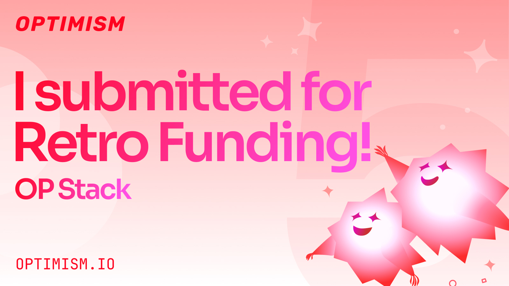

# Blockchef | Blockchain From Farm to Fork

## Revolutionizing the Food Supply Chain with BlockChef: Integrating Blockchain, DeFi, and Real-World Assets
In the ever-evolving landscape of blockchain technology, decentralized applications (DApps) have been a driving force in transforming industries. Among these, the food supply chain stands out as an area ripe for innovation. Imagine a world where the journey of your food from farm to table (we mostly call it farm-to-fork) is not only transparent but also secure, efficient, and rewarding. Enter BlockChef, a groundbreaking DApp that leverages the power of blockchain, decentralized finance (DeFi), and real-world assets (RWA) to revolutionize the food supply chain.

## The Need for Transparency and Security in the Food Supply Chain
The modern food supply chain is a complex web of interactions involving farmers, processors, distributors, retailers, and consumers. This complexity often leads to inefficiencies, fraud, and a lack of transparency. Traditional supply chains are vulnerable to numerous issues, such as counterfeit products, where unscrupulous entities introduce fake or substandard items into the supply chain. This undermines consumer trust and compromises safety.
Additionally, there is often a significant lack of traceability in the traditional food supply chain. It can be difficult to trace the origin and journey of food products, making it challenging to verify their authenticity and safety. Inefficiencies are also rampant, with multiple intermediaries causing delays and increasing costs. Moreover, food safety concerns are ever-present, as contaminated or spoiled products can go undetected until they reach consumers, posing health risks and damaging brand reputations.
Addressing these challenges is crucial for ensuring the safety, efficiency, and trustworthiness of the food supply chain. Implementing transparent and secure systems is essential to protect consumers and enhance the overall integrity of the food industry.
To summarize, traditional supply chains are vulnerable to the preceding issues:
* Counterfeit Products: Unscrupulous entities can introduce fake or substandard products into the supply chain.
* Lack of Traceability: It is often difficult to trace the origin and journey of food products.
* Inefficiencies: Multiple intermediaries lead to delays and increased costs.
* Food Safety Concerns: Contaminated or spoiled products can go undetected until they reach consumers.

## BlockChef: A Blockchain-Based Solution
BlockChef addresses these challenges by utilizing blockchain technology to create an immutable, transparent, and secure ledger of every transaction and interaction in the food supply chain. Here's how it works:
* Immutable Ledger: Every step in the supply chain, from planting and harvesting to processing and distribution, is recorded on the blockchain. This ensures that the data is tamper-proof and can be audited at any time.
* Smart Contracts: Automated smart contracts streamline transactions and enforce agreements without the need for intermediaries. This reduces costs and speeds up processes.
* Traceability: Consumers can scan a QR code on their food products to view the entire journey of the item, including its origin, processing steps, and transportation details. This builds trust and ensures food safety.

## Integrating DeFi Components for Added Benefits
BlockChef goes beyond mere transparency and security by integrating DeFi elements, adding an attractive layer of financial incentives for all participants in the supply chain.

### Rewards for Stakeholders
* Farmers: By participating in BlockChef, farmers can tokenize their produce. These tokens can be traded on DeFi platforms, allowing farmers to access liquidity and finance their operations without relying on traditional banks.
* Consumers: When consumers purchase products tracked through BlockChef, they earn reward tokens. These tokens can be used for discounts on future purchases or staked in DeFi protocols to earn interest.
* Supply Chain Partners: Processors, distributors, and retailers who adhere to best practices and maintain high-quality standards earn reward tokens. This incentivizes them to maintain transparency and efficiency.

### Decentralized Finance Mechanisms
* Yield Farming: Stakeholders can participate in yield farming by staking their tokens in liquidity pools, earning additional rewards and interest.
* Collateralized Loans: Farmers and other participants can use their tokens as collateral to obtain loans, providing them with much-needed capital to grow their operations.
* Insurance: Smart contract-based insurance can protect farmers against crop failures and other risks, ensuring financial stability.

## Real-World Assets (RWA) and Their Relation to Physical Foods
BlockChef takes innovation a step further by incorporating real-world assets (RWA), bridging the gap between the digital and physical worlds. RWAs are tokenized representations of physical assets, in this case, real foods, which are integrated into the blockchain ecosystem. This process begins with the tokenization of actual food products on the blockchain, creating digital assets that represent real-world items. This not only enhances traceability but also ensures authenticity, as each token corresponds to a specific physical product.
For farmers, this means they can tokenize their crops and use these tokens as collateral to secure loans, providing them with access to funding based on their physical produce. This RWA-backed financing model extends to distributors and retailers as well, who can leverage these tokenized goods to obtain supply chain financing, promoting liquidity and supporting the smooth operation of the supply chain.
Consumers also benefit significantly from RWA integration. Knowing that the tokens they hold are backed by real-world assets, consumers can trust the quality and authenticity of their food. This connection between digital tokens and physical products ensures a higher level of satisfaction and safety, fostering greater confidence in the food they consume. Overall, the integration of RWAs into BlockChef not only strengthens the supply chain but also provides tangible value and security to all stakeholders involved.

## Benefits for Users
BlockChef provides benefits for users, some of which are listed below:
* Transparency: Consumers gain complete visibility into the origin and journey of their food, fostering trust and ensuring safety.
* Security: Blockchain’s immutable ledger ensures that all data is secure and cannot be tampered with.
* Rewards: Participants across the supply chain are incentivized with tokens that can be used for various financial benefits.
* Efficiency: Smart contracts automate processes, reducing the need for intermediaries and cutting costs.
* Real-World Asset Integration: The tokenization of physical goods provides a tangible link between digital assets and real-world products, enhancing trust and value.

## Conclusion
BlockChef represents a paradigm shift in the food supply chain, bringing together the best of blockchain, DeFi, and RWAs to create a system that is transparent, secure, and rewarding for all participants. By leveraging this innovative DApp, we can ensure that our food is safe, our farmers are empowered, and our supply chains are efficient and resilient. As we move towards a more decentralized future, BlockChef stands at the forefront, pioneering a new era of trust and transparency in the food industry.

*Figure 1. Mahro | The main Chef at Blockchef*

